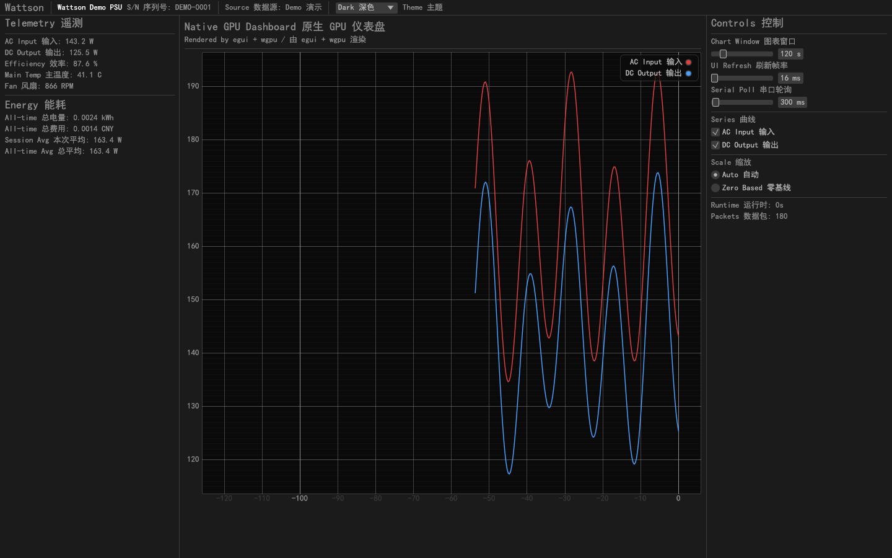
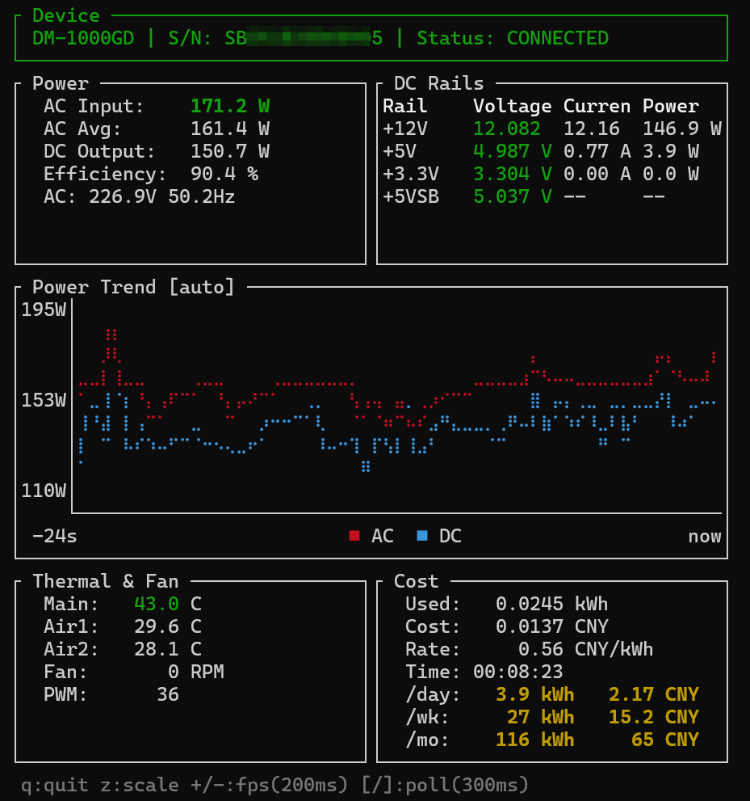

<div align="center">

# ⚡ Wattson

**Universal Digital PSU Monitoring Library**

**Universal Digital PSU Monitoring Library — Energy Sensing Layer of the [ExoMind](https://github.com/exomind-team/exomind) Ecosystem**

通用数字电源监控库 — [ExoMind](https://github.com/exomind-team/exomind) 生态的能量感知层

[](LICENSE)
[](https://www.rust-lang.org/)
[](https://github.com/exomind-team/wattson/actions)

</div>

---

## 💡 Why Wattson? / 为什么做这个？

Digital PSUs (数字电源) expose real-time telemetry over USB — voltages, currents, temperatures, fan speed — but the vendor software (e.g., HiMOS) typically only refreshes once every 1–2 seconds, with no data export or cost tracking. For anyone who wants to:

- **Monitor electricity costs** — know exactly how much it costs to run your PC per day/week/month
- **Integrate power data** into research workflows, home automation, or dashboards
- **Push the sampling rate** — Wattson queries at 300ms (3.3 Hz), 3–6× faster than vendor tools
- **Understand the protocol** — reverse-engineer and document the binary serial protocol for future hardware

We built Wattson. It started with a Segotep DM-1000G and curiosity about what's actually on the wire. The protocol turned out to be straightforward (header + big/little-endian uint16 arrays + checksum), and the result is a general-purpose library that could support any digital PSU with similar serial protocols.

数字电源通过 USB 暴露实时遥测数据，但厂商软件（如 HiMOS）刷新慢（1–2秒）、不能导出数据、没有电费统计。我们想知道开一天电脑到底花多少钱，想把功率数据接入自己的研究流程，想把采样率推到极限。于是从逆向鑫谷 DM-1000G 的串口协议开始，写了这个通用数字电源监控库。

---

## 📊 Real-time Monitoring / 实时监控

<div align="center">



*Native GUI dashboard: `egui` + `wgpu`, theme-aware, fast desktop rendering*

</div>

### Legacy TUI / 传统 TUI

<div align="center">



*TUI dashboard: power trend chart, DC rails, thermal & fan, cost tracking*

</div>

| Metric | Min | Max | Avg |
|--------|-----|-----|-----|
| AC Input Power | 133W | 236W | **162W** |
| DC Output Power | 117W | 193W | 137W |
| Efficiency | 82% | 91% | 86% |

---

## ✨ Features / 功能特点

- **🖼️ Native GUI dashboard (`egui` + `wgpu`)** — GPU-backed desktop UI with live charts, theme switching, and control-side settings
  原生桌面界面（`egui` + `wgpu`）— GPU 渲染实时图表、主题切换和图形控制设置
- **🔌 Real-time power monitoring** — AC input (EMA-smoothed), DC output, conversion efficiency
  实时功率监控 — AC 输入（EMA 平滑）、DC 输出、转换效率
- **📈 TUI dashboard with live chart** — Dual-line power trend (AC red / DC cyan), auto-zoom Y-axis, Braille markers
  TUI 面板 + 实时图表 — 双线功率趋势、自动缩放 Y 轴
- **💰 Electricity cost tracking** — Session-wide average power → day/week/month projections. Energy accumulated via numerical integration (left Riemann sum, f64 precision — safe for years of continuous operation)
  电费追踪 — 全程平均功率推算日/周/月费用，数值积分累加能量（f64 精度，可连续运行数年无溢出）
- **📊 Chart generation** — Power/efficiency/temperature curves as PNG
  图表生成 — 功率/效率/温度曲线
- **🖥️ Three modes** — CLI (one-shot), TUI (dashboard), API (HTTP server)
  三种传统模式仍保留 — 命令行、终端面板、HTTP API
- **🌗 Theme support** — Light / Dark / System modes with persisted GUI settings
  主题支持 — 浅色 / 深色 / 跟随系统，并持久化图形设置
- **⚙️ Independent rate control** — TUI refresh (200ms–2s) and serial poll (200ms–5s) independently adjustable at runtime
  独立速率控制 — TUI 刷新率和串口发包率运行时独立可调
- **🔄 Active query by default** — 300ms poll interval, 3.3× faster than vendor software (HiMOS)
  默认主动查询 — 300ms 轮询，比厂商软件快 3.3 倍

### GUI Controls / 图形控制项

| Control 控制 | Description 说明 |
|--------------|------------------|
| Theme 主题 | `System / Light / Dark` |
| Chart Window 图表窗口 | 30–600 seconds |
| UI Refresh 刷新率 | 16–1000 ms |
| Serial Poll 轮询间隔 | 200–5000 ms |
| Series 曲线显隐 | AC / DC independently toggleable |
| Scale 缩放 | Auto / Zero Based |

### TUI Hotkeys / TUI 快捷键

| Key 按键 | Action 功能 |
|----------|------------|
| `q` | Quit 退出 |
| `z` | Toggle chart scale: auto-zoom / zero-based 切换图表缩放模式 |
| `+` / `-` | Adjust TUI refresh rate (200ms–2000ms) 调节画面刷新率 |
| `]` / `[` | Adjust serial poll rate (200ms–5000ms) 调节串口发包率 |

### Algorithm / 算法说明

```
AC Input    = EMA-smoothed instantaneous power (α=0.5)
              EMA 平滑后的瞬时功率

AC Average  = total_wh / duration_h  (session-wide, stabilizes over time)
              全程累计能量 ÷ 运行时长 = 真实平均功率

Energy (Wh) = Σ P(tᵢ) × Δtᵢ  (numerical integration, f64 accumulator)
              数值积分，每个 tick 累加 功率×时间间隔

Cost        = energy_kwh × price_per_kwh
Daily est.  = session_avg_w × 24h / 1000 × price
```

---

## 🔧 Supported Hardware / 支持的硬件

| Brand 品牌 | Series 系列 | Interface 接口 | Status 状态 |
|------------|-------------|---------------|-------------|
| Segotep 鑫谷 | DM series (DM-850G, **DM-1000G**, ...) | CH340 UART 115200-8N1 | ✅ Tested 已验证 |
| Segotep 鑫谷 | KE series (KE-1300P) | CH340 UART 115200-8N1 | 🔧 Compatible 兼容 |
| *Others 其他* | *Contributions welcome 欢迎贡献* | — | — |

---

## 🚀 Quick Start / 快速开始

### Install / 安装

```bash
# From source
git clone https://github.com/exomind-team/wattson.git
cd wattson
cargo build --release
```

### Initialize / 初始化

```bash
# Generate config file
wattson config init

# Check available ports
wattson ports
```

### Usage / 使用

```bash
# Default desktop launch (GUI-first)  默认启动原生 GUI
wattson

# Native GUI with deterministic demo data  用演示数据启动 GUI
wattson gui --demo

# One-shot read (JSON output)  一次读取
wattson read

# Read for 60 seconds  读取 60 秒
wattson read --duration 60

# Continuous JSON stream  持续输出
wattson watch

# Interactive TUI dashboard  交互式面板
wattson tui

# HTTP API server  API 服务器
wattson serve

# Generate chart  生成图表
wattson chart --last 60
```

### Configuration / 配置管理

```bash
# View config  查看配置
wattson config show

# Set serial port  设置串口
wattson config set port COM4

# Set electricity price (CNY/kWh)  设置电价
wattson config set price 0.56

# Set communication mode  设置通信模式
wattson config set mode passive
```

### API Endpoints / API 接口

When running `wattson serve`:

| Endpoint | Description |
|----------|-------------|
| `GET /api/status` | Full PSU snapshot 完整快照 |
| `GET /api/power` | Power data only (AC/DC/efficiency) 功率数据 |
| `GET /api/voltage` | DC voltage readings 电压 |
| `GET /api/temperature` | Temperature sensors 温度 |
| `GET /api/device` | Device info 设备信息 |
| `GET /api/cost` | Electricity cost 电费 |
| `GET /health` | Health check 健康检查 |

---

## 🧪 Testing / 测试

```bash
# Full test suite  全量测试
cargo test

# GUI snapshot/e2e coverage  GUI 快照与端到端覆盖
cargo test --test gui_e2e -- --nocapture
```

---

## 📐 Configuration File / 配置文件

`wattson.toml`:

```toml
[serial]
port = "COM4"          # Serial port 串口
baud = 115200          # Baud rate 波特率
mode = "passive"       # passive | active 被动|主动

[device]
profile = "segotep_dm" # Device calibration profile 设备校准

[cost]
price_per_kwh = 0.56   # Electricity price 电价 (CNY/kWh)
currency = "CNY"       # Currency 货币

[chart]
output_dir = "./charts"
watermark = "Wattson | exomind-team/wattson"

[api]
port = 8066            # HTTP API port
```

---

## 🔬 Protocol Details / 协议细节

Wattson communicates with digital PSUs via USB serial (CH340/CH341 UART). The protocol uses a custom binary frame format:

```
[0x55][0x7E][LEN][PAYLOAD...][CHECKSUM_HI][CHECKSUM_LO][0xAE]
```

| Packet | Content | Byte Order |
|--------|---------|------------|
| `0x02` | Voltages, currents, AC input, fan RPM | Little-endian |
| `0x03` | Device model string | ASCII |
| `0x04` | Temperature, fan mode, AC power | Big-endian |
| `0x05` | Serial number | ASCII |

---

## 🙏 Acknowledgments / 致谢

Protocol reverse engineering based on:
- [YveMU/segotepk-psu-communication-protocol-driver](https://github.com/YveMU/segotepk-psu-communication-protocol-driver) — DM series protocol
- [SaltyFishOnTheSea/Segotep-PSU-Toolbox](https://github.com/SaltyFishOnTheSea/Segotep-PSU-Toolbox) — KE-1300P protocol

---

## 📄 License / 许可证

[CCOPL-1.0](LICENSE) — Contributors' Collective Ownership Public License

Copyright (c) 2026 ExoMind Collective

---

<div align="center">

**Part of the [ExoMind](https://github.com/exomind-team/exomind) ecosystem**

[ExoMind](https://github.com/exomind-team/exomind) · [ExoMind Cell](https://github.com/exomind-team/exomind-cell) · [CCOPL License](https://github.com/exomind-team/ccopl)

</div>
